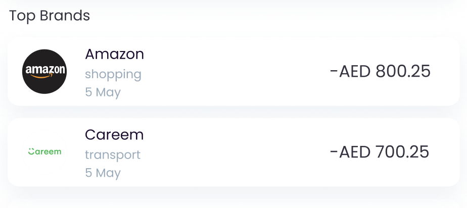

# Brand List Component



The `BrandListComponent` shows a list of brands the user has patronized.
To use this view, just call the `BrandListComponent` method of your
`LuneSDKManager` instance as shown in the example below.

```kotlin
// BrandListView.kt

import io.lunedata.lunesdk.library.classes.LuneSDKManager

@Composable
fun BrandListComponent(
    luneSDK: LuneSDKManager
) {
    luneSDK.BrandListComponent()
}
```

To use this view in a project with Activities and Fragments, set the
`component` property of your view to `LuneView.BrandListComponent`, as
shown in the example below.

```kotlin
// YourActivity.kt

override fun onCreate(savedInstanceState: Bundle?) {
    super.onCreate(savedInstanceState)

    // Grab our luneView and set the component property.
    val luneView = findViewById<LuneCompatManager>(R.id.luneLayout)
    luneView.component = LuneView.BrandListComponent
}
```
