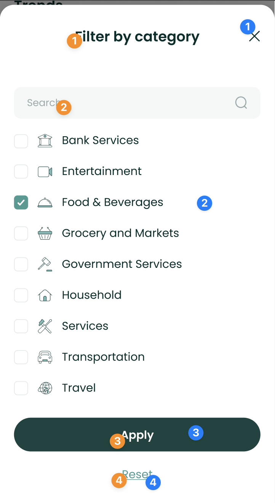

# Brand Trends Component


Besides showing the user's spend on each Brand, the
`BrandTrendsComponent` uses a chart to show the

user's spend per day. It also allows users to filter data by category,
tags and dates by default.

To use this view, just call the `BrandTrendsComponent` method of your
`LuneSDKManager` instance as

shown in the example below.

```kotlin
// TrendView.kt

import io.lunedata.lunesdk.library.classes.LuneSDKManager

@Composable
fun TrendView(
    luneSDK: LuneSDKManager
) {
    luneSDK.BrandTrendsComponent()
}
```

To use this view in a project with Activities and Fragments, set the
`component` property of your view to `LuneView.BrandTrendsComponent`, as
shown in the example below.

```kotlin
// YourActivity.kt

override fun onCreate(savedInstanceState: Bundle?) {
    super.onCreate(savedInstanceState)

    // Grab our luneView and set the component property.
    val luneView = findViewById<LuneCompatManager>(R.id.luneLayout)
    luneView.component = LuneView.BrandTrendsComponent
}
```

---

## Localization Keys and Analytics


Analytics Tags

1. `date_picker_button`
2. `filter_button`
3. `spending_amount`
4. `brand_amount`
5. `brand_tile`

Localization Keys

1. `lune_sdk_str_brand_trends`
2. `lune_sdk_str_spending`
3. `lune_sdk_str_top_brands`

---



Analytics Tags

1. `close_button`
2. `category_filter_option`
3. `apply_button`
4. `reset_button`

Localization Keys

1. `lune_sdk_str_filter_by_category`
2. `lune_sdk_str_search`
3. `lune_sdk_str_apply`
4. `lune_sdk_str_reset`
