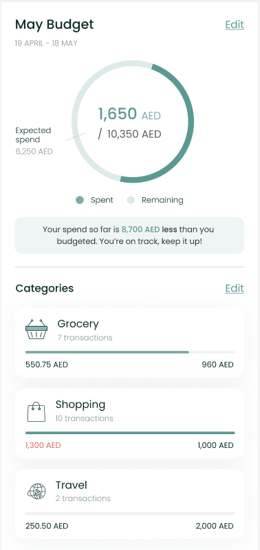

# Budget Component



The `BudgetComponent` shows the user's spend against the budget he/she
had set previously. In the case

that the user doesn't already have a budget, it allows the user to set
one easily.

To use this view, just call the `BudgetComponent` method of your
`LuneSDKManager` instance as shown

in the example below.

```kotlin
// BudgetView.kt

import io.lunedata.lunesdk.library.classes.LuneSDKManager

@Composable
fun BudgetView(
    luneSDK: LuneSDKManager
) {
    luneSDK.BudgetComponent()
}
```

To use this view in a project with Activities and Fragments, set the
`component` property of your view to `LuneView.BudgetComponent`, as
shown in the example below.

```kotlin
// YourActivity.kt

override fun onCreate(savedInstanceState: Bundle?) {
    super.onCreate(savedInstanceState)

    // Grab our luneView and set the component property.
    val luneView = findViewById<LuneCompatManager>(R.id.luneLayout)
    luneView.component = LuneView.BudgetComponent
}
```
