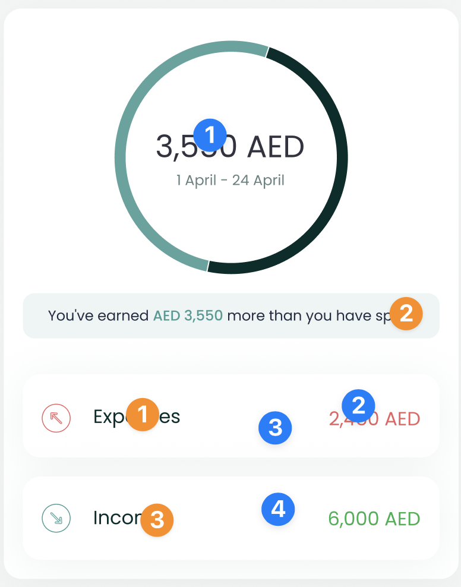

# Cashflow Component


The `CashflowComponent` shows the user's gross expense and income over a
period of time, along with the

difference between them. To use this view, just call the
`CashflowComponent` method of

your `LuneSDKManager` instance as shown in the example below.

```kotlin
// CashflowView.kt

import io.lunedata.lunesdk.library.classes.LuneSDKManager

@Composable
fun CashflowView(
    luneSDK: LuneSDKManager
) {
    luneSDK.CashflowComponent()
}
```

To use this view in a project with Activities and Fragments, set the
`component` property of your view to `LuneView.CashflowComponent`, as
shown in the example below.

```kotlin
// YourActivity.kt

override fun onCreate(savedInstanceState: Bundle?) {
    super.onCreate(savedInstanceState)

    // Grab our luneView and set the component property.
    val luneView = findViewById<LuneCompatManager>(R.id.luneLayout)
    luneView.component = LuneView.CashflowComponent
}
```

✨ You can now add an optional argument to the
`CashflowViewParams(view)` parameter if you need to render a custom view
as the footer of the screen.

Here is a simple example with a list of cards.

```kotlin
            lunekit = LuneSDKManager(
                baseUrl = ClientApi.baseURl ?: "",
                token?: "",
            )


            val luneView = findViewById<LuneCompatManager>(R.id.luneLayout)

            val view = layoutInflater.inflate(R.layout.layout_recycle, null, false)

            val recyclerview = view.findViewById<RecyclerView>(R.id.list_item)
            val viewAll = view.findViewById<TextView>(R.id.tv_viewAll)

            viewAll.setOnClickListener {
                Toast.makeText(this, "View All Click Action", Toast.LENGTH_LONG).show()
            }

            recyclerview.layoutManager = LinearLayoutManager(this, RecyclerView.HORIZONTAL, false)

            val data = ArrayList<String>()
            for (i in 1..20) {
                data.add("Item $i")
            }

            val adapter = CustomAdapter(data)
            recyclerview.adapter = adapter

            luneView.manager = lunekit
            luneView.component = LuneView.CashflowComponent
            luneView.data =  CashflowViewParams(view)
```

---

## Localization Keys and Analytics

/



Analytics Tags

1. `cashflow_amount`
2. `outflow_amount`
3. `outflow_tile`
4. `inflow_tile`

Localization Keys

1. `lune_sdk_str_outflow`
2. `lune_sdk_str_inflow`
3. `lune_sdk_str_you_ve_spent`,
   `lune_sdk_str_more_than_you_have_earned`,
   `lune_sdk_str_you_ve_earned`,
   `lune_sdk_str_more_than_you_have_spent`
