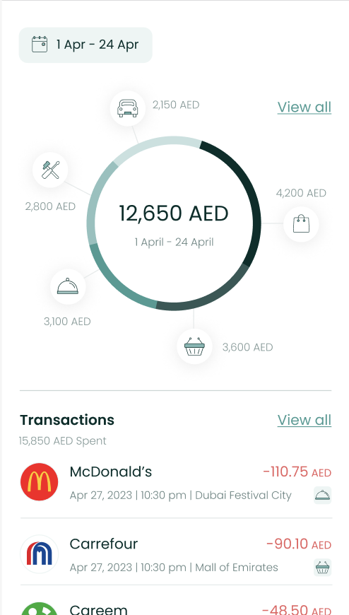
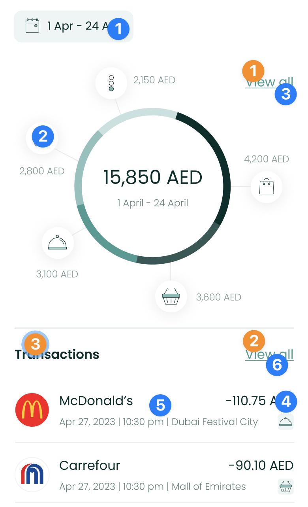
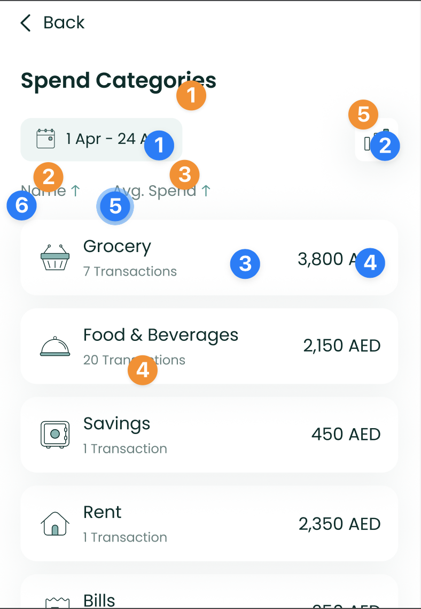

# Expense Component



The `ExpenseComponent` shows the user's spend across categories in a
neat donut chart, along with a

list of recent transactions. Users are able to view data for previous
months easily too. To use this view, just call the `ExpenseComponent`
method of your `LuneSDKManager` instance as shown in the

example below.

```kotlin
// ExpenseView.kt

import io.lunedata.lunesdk.library.classes.LuneSDKManager

@Composable
fun ExpenseView(
    luneSDK: LuneSDKManager
) {
    luneSDK.ExpenseComponent()
}
```

To use this view in a project with Activities and Fragments, set the
`component` property of your view to `LuneView.ExpenseComponent`, as
shown in the example below.

```kotlin
// YourActivity.kt

override fun onCreate(savedInstanceState: Bundle?) {
    super.onCreate(savedInstanceState)

    // Grab our luneView and set the component property.
    val luneView = findViewById<LuneCompatManager>(R.id.luneLayout)
    luneView.component = LuneView.ExpenseComponent
}
```

✨ You can now add an optional argument to the `ExpenseViewParams(view)`
parameter if you need to render a custom view between the chart and the
transaction list.

Here is a simple example with a list of cards.

```kotlin
            lunekit = LuneSDKManager(
                baseUrl = ClientApi.baseURl ?: "",
                token?: "",
            )


            val luneView = findViewById<LuneCompatManager>(R.id.luneLayout)

            val view = layoutInflater.inflate(R.layout.layout_recycle, null, false)

            val recyclerview = view.findViewById<RecyclerView>(R.id.list_item)
            val viewAll = view.findViewById<TextView>(R.id.tv_viewAll)

            viewAll.setOnClickListener {
                Toast.makeText(this, "View All Click Action", Toast.LENGTH_LONG).show()
            }

            recyclerview.layoutManager = LinearLayoutManager(this, RecyclerView.HORIZONTAL, false)

            val data = ArrayList<String>()
            for (i in 1..20) {
                data.add("Item $i")
            }

            val adapter = CustomAdapter(data)
            recyclerview.adapter = adapter

            luneView.manager = lunekit
            luneView.component = LuneView.ExpenseComponent
            luneView.data =  ExpenseViewParams(view)

```

## Localization Keys and Analytics



Analytics Tags

1. `date_picker_button`
2. `chart_icon`
3. `chart_view_all`
4. `transaction_amount`
5. `transaction_tile`
6. `transactions_view_all`

Localization Keys

1. `lune_sdk_str_view_all`
2. `lune_sdk_str_view_all`
3. `lune_sdk_str_transactions`

---



Analytics Tags

1. `date_picker_button`
2. `trends_button`
3. `category_tile`
4. `category_amount`
5. `avg_spend_sort_button`
6. `name_sort_button`

Localization Keys

1. `lune_sdk_str_all_spends`
2. `lune_sdk_str_name`
3. `lune_sdk_str_avg_spend`
4. `lune_sdk_str_transactions`
5. `lune_sdk_str_trends`
