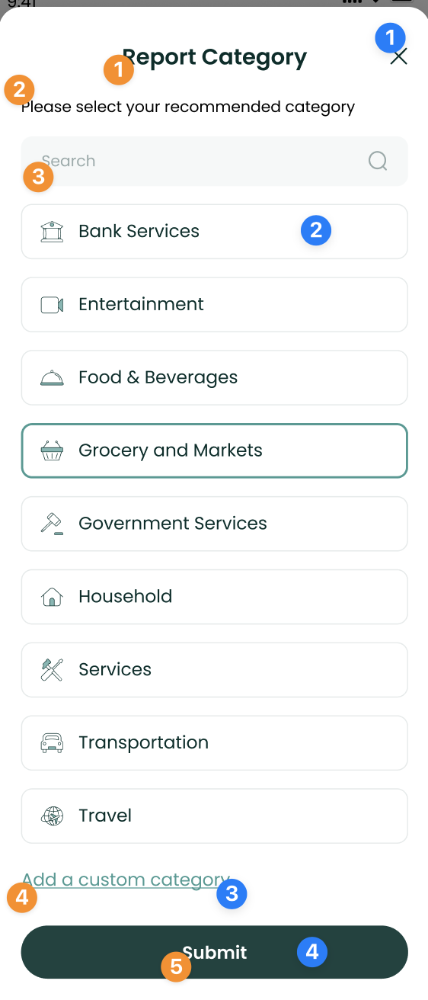

# Transaction Detail Component


The `TransactionDetailComponent` shows users information about a
specific transaction and allows them

to update its category or Brand, in case they are inaccurate. To use
this view, just call the `TransactionDetailC+`

`omponent` method of your `LuneSDKManager` instance as shown in the
example below. The method takes the `id` of the transaction as an
argument.

```kotlin
// TransactionDetailView.kt

import io.lunedata.lunesdk.library.classes.LuneSDKManager

@Composable
fun TransactionDetailComponent(
    luneSDK: LuneSDKManager
) {
    luneSDK.TransactionDetailComponent(id = transaction.id)
}
```

To use this view in a project with Activities and Fragments, set the
`data` property of your view to the `transaction ID,` and the
`component` property should be set to
`LuneView.TransactionDetailComponent`, as shown in the example below.

```kotlin
// YourActivity.kt

override fun onCreate(savedInstanceState: Bundle?) {
    super.onCreate(savedInstanceState)

    // Grab our luneView
    val luneView = findViewById<LuneCompatManager>(R.id.luneLayout)

    //set the data property to the transaction ID
    luneView.data = <transaction.id>

    // set the component property.
    luneView.component = LuneView.TransactionDetailComponent
}
```

---

## Localization Keys and Analytics


Analytics Tags

1. `report_transaction_button`
2. `save_button`

Localization Keys

1. `lune_sdk_str_amount`
2. `lune_sdk_str_date`, `lune_sdk_str_date_time`
3. `lune_sdk_str_category`
4. `lune_sdk_str_suggested_category`
5. `lune_sdk_str_raw_transaction`
6. `lune_sdk_str_notes`
7. `lune_sdk_str_tap_to_add_notes`
8. `lune_sdk_str_tags`
9. `lune_sdk_str_tap_to_add_tags`
10. `lune_sdk_str_report_transaction`, `lune_sdk_str_cancel_report`
11. `lune_sdk_str_save`

---


Analytics Tags

1. `close_button`
2. `incorrect_brand_tile`
3. `incorrect_logo_tile`
4. `incorrect_category_tile`
5. `report_button`

Localization Keys

1. `lune_sdk_str_report_transaction_title`
2. `lune_sdk_str_incorrect_brand_name`
3. `lune_sdk_str_suggested_brand`
4. `lune_sdk_str_incorrect_logo`
5. `lune_sdk_str_incorrect_category`
6. `lune_sdk_str_report`
7. `lune_sdk_str_brand_name`

---



Analytics Tags

1. `close_button`
2. `category_filter_option`
3. `custom_category_button`
4. `submit_button`

Localization Keys

1. `lune_sdk_str_report_category`
2. `lune_sdk_str_please_select_category`
3. `lune_sdk_str_search`
4. `lune_sdk_str_add_a_custom_category`
5. `lune_sdk_str_submit`

---


Analytics Tags

1. `close_button`
2. `submit_button`

Localization Keys

1. `lune_sdk_str_add_a_custom_category`
2. `lune_sdk_str_category_name_field_label`
3. `lune_sdk_str_category_name`
4. `lune_sdk_str_submit`

---


Analytics Tags

1. `close_button`

Localization Keys

1. `lune_sdk_str_update_done`
