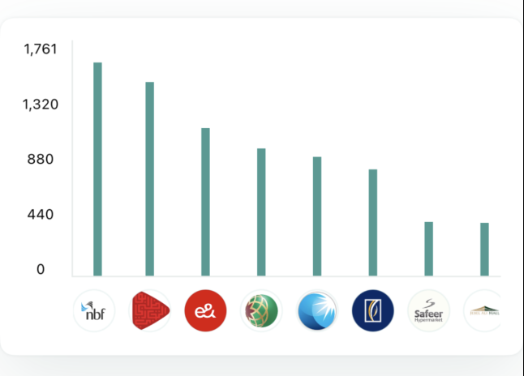

# Brand Trend Chart Component



The `BrandTrendChartComponent` shows the user's spend across different
brands in a chart.

To use this view, just call the `BrandTrendChartComponent` method of
your `LuneSDKManager` instance as shown in the example below. You can
pass in optional `startDate` and `endDate` arguments to filter the data
shown.

```kotlin
// TrendView.kt

import io.lunedata.lunesdk.library.classes.LuneSDKManager

@Composable
fun TrendView(
    luneSDK: LuneSDKManager
) {
    luneSDK.BrandTrendChartComponent(startDate = "",
           endDate = "")
}
```

To use this view in a project with Activities and Fragments, set the
`component` property of your view to
`LuneView.BrandTrendChartComponent`, as shown in the example below.

```kotlin
// YourActivity.kt

override fun onCreate(savedInstanceState: Bundle?) {
    super.onCreate(savedInstanceState)

    // Grab our luneView and set the component property.
    val luneView = findViewById<LuneCompatManager>(R.id.luneLayout)
    luneView.component = LuneView.BrandTrendChartComponent
    luneView.data =  BrandTrendDateRangeParams(startDate = "", endDate = "")
}
```
