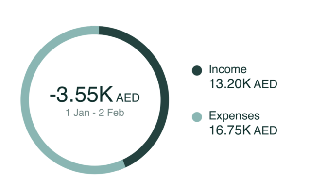

# Cashflow Chart Component



The `CashflowChartComponent` shows the user's gross expense and income
over a period of time, along with the difference between them, in a
clean customizable donut chart.

To use this component, just call the `CashflowChartComponent` method of
your `LuneSDKManager` instance, as shown in the example below. You can
pass in optional `startDate` and `endDate` arguments to filter the data
shown.

```kotlin
// CashflowView.kt

import io.lunedata.lunesdk.library.classes.LuneSDKManager

@Composable
fun CashflowView(
    luneSDK: LuneSDKManager
) {
    luneSDK.CashflowChartComponent(startDate = "",
           endDate = "", showAmountLabel = true)
}
```

To use this view in a project with Activities and Fragments, set the
`component` property of your view to `LuneView.CashflowComponent`, as
shown in the example below.

```kotlin
// YourActivity.kt

override fun onCreate(savedInstanceState: Bundle?) {
    super.onCreate(savedInstanceState)

    // Grab our luneView and set the component property.
    val luneView = findViewById<LuneCompatManager>(R.id.luneLayout)
    luneView.component = LuneView.CashflowChartComponent
    luneView.data = CashflowDateRangeParams(startDate = "",
           endDate = "", showAmountLabel = true)
}
```
