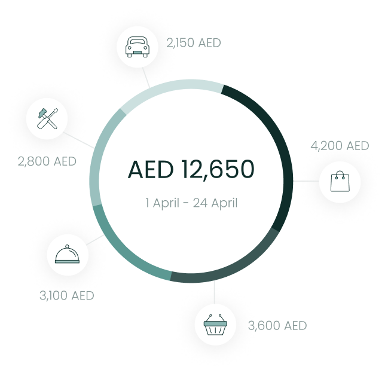

# Category Spend Chart Component



The `CategorySpendChartComponent` shows the user's most significant
spend across various expense

categories. To use this view, just call the
`CategorySpendChartComponent` method of your `LuneSDKManager`

instance as shown in the example below.

```kotlin
// CategorySpendView.kt

import io.lunedata.lunesdk.library.classes.LuneSDKManager

@Composable
fun CategorySpendView(
    luneSDK: LuneSDKManager
) {
    luneSDK.CategorySpendChartComponent()
}
```

To use this view in a project with Activities and Fragments, set the
`component` property of your view to
`LuneView.CategorySpendChartComponent`, as shown in the example below.

```kotlin
// YourActivity.kt

override fun onCreate(savedInstanceState: Bundle?) {
    super.onCreate(savedInstanceState)

    // Grab our luneView and set the component property.
    val luneView = findViewById<LuneCompatManager>(R.id.luneLayout)
    luneView.component = LuneView.CategorySpendChartComponent
}
```
